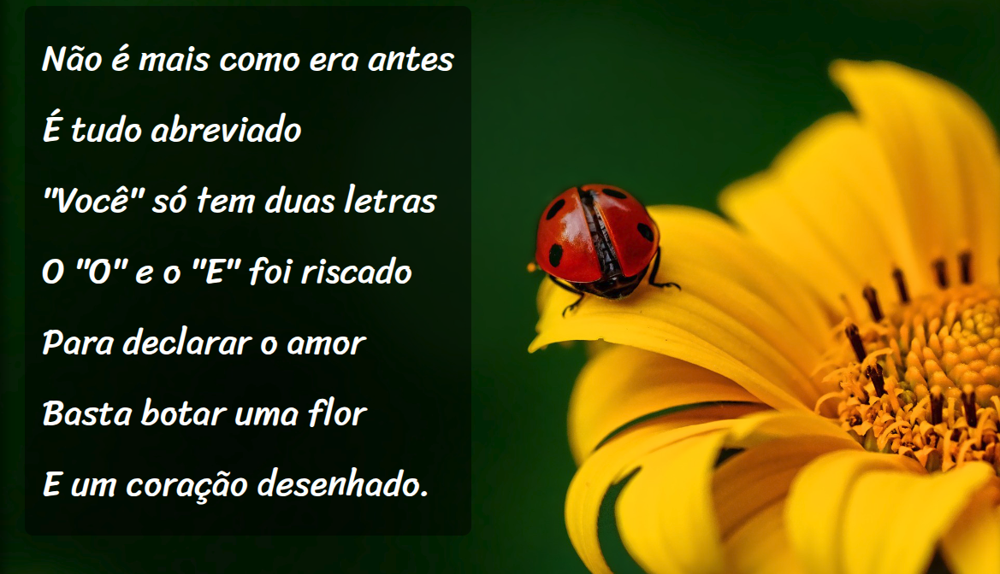

# 📜 Projeto Cordel Moderno

Projeto desenvolvido durante os estudos de **HTML5 e CSS3** no curso do **Gustavo Guanabara — Curso em Vídeo**.

O objetivo do projeto é praticar a criação de páginas web utilizando **HTML semântico, CSS, imagens de fundo, efeitos de paralaxe e responsividade**, reproduzindo uma página inspirada na literatura de cordel.

## 🚀 Tecnologias utilizadas

* HTML5
* CSS3
* Google Fonts
* Backgrounds com imagens
* Efeito Parallax
* Design responsivo

## 📖 Sobre o projeto

O projeto apresenta o poema **"Cordel Moderno"**, de **Milton Duarte**, utilizando diferentes seções e imagens de fundo para criar uma experiência visual inspirada no estilo de um cordel.

Durante o desenvolvimento, foram praticados conceitos como:

* Estruturação semântica com HTML5
* Seletores e propriedades CSS
* Fontes personalizadas
* `background-image`
* `background-attachment`
* Efeito Parallax
* Espaçamentos e dimensionamento
* Responsividade
* Organização de código

## 🎯 Objetivo

Este projeto faz parte da minha jornada de aprendizado em **Desenvolvimento Web**, servindo como prática para aprimorar meus conhecimentos em **HTML e CSS** e compreender melhor como estruturar e estilizar páginas web.

## 🖥️ Demonstração

🔗 **Projeto online:**
http://eslones.github.io/Projeto-Cordel

## 📸 Preview

> Adicione aqui uma imagem ou GIF do seu projeto.

```md

```

## 📂 Estrutura do projeto

```text
## 📂 Estrutura do projeto

projeto-cordel/
│
├── index.html
│
├── css/
│   └── styles.css
│
├── img/
│   ├── background001.jpg
│   └── background002.jpg
│
└── README.md

```

## 👨‍💻 Autor

**Matheus Candido**

Projeto desenvolvido para fins de **estudo e prática de desenvolvimento web**.

---

### 🎓 Créditos

Projeto baseado na aula de **HTML5 e CSS3** do professor **Gustavo Guanabara**, do **Curso em Vídeo**.

* Professor: Gustavo Guanabara
* Curso: HTML5 e CSS3
* Poema: Milton Duarte

---

⭐ Se este projeto foi útil para você, considere deixar uma estrela no repositório!
